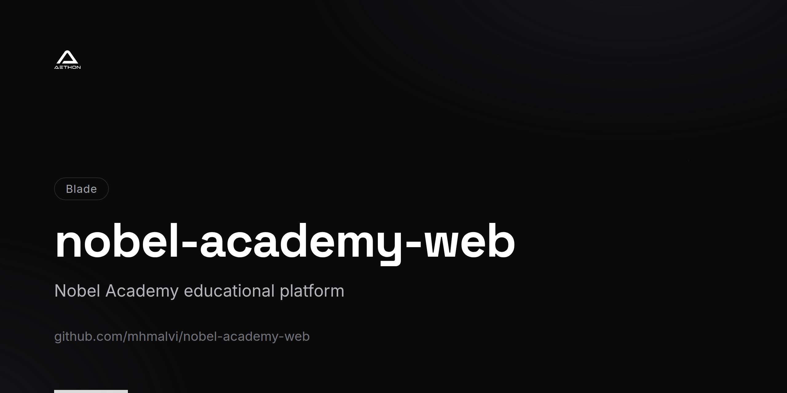

<!-- repo-card -->


# Nobel Academy Web

The official website for **Nobel Academy**, built with Laravel 8 and Jetstream. This platform serves as the public-facing web presence, featuring course showcases, blog publishing, application processing, and RPL eligibility checks.

## Overview

Nobel Academy Web is a server-rendered web application that combines a public website with an authenticated admin panel. It leverages Laravel Jetstream with Livewire for interactive features, Tailwind CSS for styling, and includes integrated email workflows for applications and inquiries.

## Tech Stack

| Layer       | Technology                                         |
|-------------|-----------------------------------------------------|
| Backend     | PHP 7.3+, Laravel 8                               |
| Frontend    | Blade Templates, Livewire, Tailwind CSS, SASS      |
| Auth        | Laravel Jetstream (Livewire stack), Fortify         |
| Database    | MySQL                                              |
| Media       | Intervention Image                                 |
| SEO         | Eloquent Sluggable, Sitemap, Google Verification    |
| DataTables  | Yajra Laravel DataTables                           |
| Rich Text   | Quill Editor                                       |
| Build Tools | Laravel Mix 6, Webpack                             |
| Containers  | Docker (docker-compose.yml)                        |
| Testing     | PHPUnit                                            |

## Key Features

### Public Website
- Course catalog and showcase pages
- Blog with categories and rich-text content
- SEO-optimized with sitemap and sluggable URLs
- Google site verification

### Application & Eligibility
- Online application form with email notifications
- RPL (Recognition of Prior Learning) eligibility checker
- Contact form with automated email responses

### Blog Management
- Full blog CRUD with rich-text Quill editor
- Category-based organization
- Admin DataTable interface for blog management
- Image upload and processing

### Admin Panel
- Dashboard with platform overview
- Blog and category management
- Profile and settings management
- Team management (Jetstream Teams)
- Two-factor authentication support

### Email System
- Application submission notifications (ApplyNow)
- Contact form processing (ContactUs)
- RPL eligibility inquiry emails

### User Features
- User registration and authentication
- Profile management with photo uploads
- Two-factor authentication
- Password reset workflows
- File download capabilities

## Project Structure

```
app/
├── Http/Controllers/
│   ├── Admin/              # Blog, category, dashboard management
│   ├── BlogController.php  # Public blog display
│   ├── CoursesController.php
│   ├── HomeController.php
│   ├── MailController.php  # Email handling
│   └── PolicyController.php
├── Mail/                   # Mailable classes (ApplyNow, ContactUs, RPL)
├── Models/                 # Blog, Category, EligibilityRequest, etc.
├── DataTables/             # Server-side DataTable definitions
├── Actions/Fortify/        # Jetstream auth actions
└── Actions/Jetstream/      # Team management actions
resources/views/
├── admin/                  # Admin panel Blade templates
├── auth/                   # Authentication views
├── components/             # Shared UI components (navbar, footer, slider)
├── partials/               # Page partials and slides
├── profile/                # Profile management views
└── teams/                  # Team management views
routes/
├── web.php                 # All web routes
└── api.php                 # API routes
```

## Prerequisites

- PHP >= 7.3
- Composer
- Node.js & npm
- MySQL

## Installation

1. **Clone the repository**
   ```bash
   git clone https://github.com/mhmalvi/nobel-academy-web.git
   cd nobel-academy-web
   ```

2. **Install dependencies**
   ```bash
   composer install
   npm install
   ```

3. **Configure environment**
   ```bash
   cp .env.example .env
   php artisan key:generate
   ```

4. **Set up the database**

   Configure your MySQL connection in `.env` and run:
   ```bash
   php artisan migrate
   ```

5. **Configure mail**

   Set your SMTP credentials in `.env` for application and contact form emails.

6. **Build frontend assets**
   ```bash
   npm run dev        # Development
   npm run production # Production
   ```

7. **Start the server**
   ```bash
   php artisan serve
   ```

## License

This project is proprietary software developed for Nobel Academy.